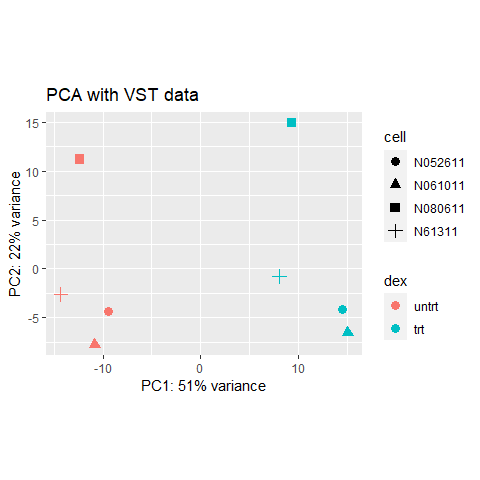
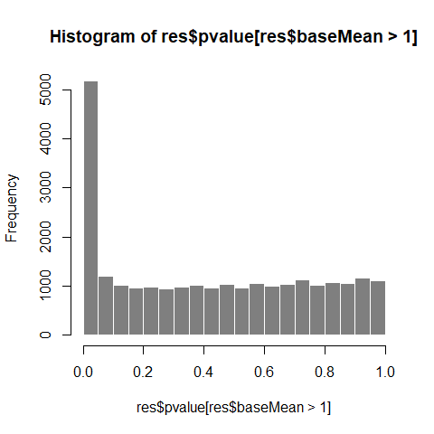

Installing the required package if not already availible on your PC

Sample code if (!requireNamespace(“BiocManager”, quietly = TRUE))
install.packages(“BiocManager”)

    BiocManager::install("rnaseqGene")
    BiocManager::install("airway")

``` r
## ----dir----------------------------------------------------------------------
dir <- system.file("extdata", package="airway", mustWork=TRUE)

## ----list.files---------------------------------------------------------------
list.files(dir)
```

    ##  [1] "GSE52778_series_matrix.txt"        "Homo_sapiens.GRCh37.75_subset.gtf"
    ##  [3] "quants"                            "sample_table.csv"                 
    ##  [5] "SraRunInfo_SRP033351.csv"          "SRR1039508_subset.bam"            
    ##  [7] "SRR1039509_subset.bam"             "SRR1039512_subset.bam"            
    ##  [9] "SRR1039513_subset.bam"             "SRR1039516_subset.bam"            
    ## [11] "SRR1039517_subset.bam"             "SRR1039520_subset.bam"            
    ## [13] "SRR1039521_subset.bam"

``` r
list.files(file.path(dir, "quants"))
```

    ## [1] "SRR1039508" "SRR1039509"

``` r
## ----sampleinfo---------------------------------------------------------------
csvfile <- file.path(dir, "sample_table.csv")
coldata <- read.csv(csvfile, row.names=1, stringsAsFactors=FALSE)
coldata
```

    ##            SampleName    cell   dex albut        Run avgLength Experiment
    ## SRR1039508 GSM1275862  N61311 untrt untrt SRR1039508       126  SRX384345
    ## SRR1039509 GSM1275863  N61311   trt untrt SRR1039509       126  SRX384346
    ## SRR1039512 GSM1275866 N052611 untrt untrt SRR1039512       126  SRX384349
    ## SRR1039513 GSM1275867 N052611   trt untrt SRR1039513        87  SRX384350
    ## SRR1039516 GSM1275870 N080611 untrt untrt SRR1039516       120  SRX384353
    ## SRR1039517 GSM1275871 N080611   trt untrt SRR1039517       126  SRX384354
    ## SRR1039520 GSM1275874 N061011 untrt untrt SRR1039520       101  SRX384357
    ## SRR1039521 GSM1275875 N061011   trt untrt SRR1039521        98  SRX384358
    ##               Sample    BioSample
    ## SRR1039508 SRS508568 SAMN02422669
    ## SRR1039509 SRS508567 SAMN02422675
    ## SRR1039512 SRS508571 SAMN02422678
    ## SRR1039513 SRS508572 SAMN02422670
    ## SRR1039516 SRS508575 SAMN02422682
    ## SRR1039517 SRS508576 SAMN02422673
    ## SRR1039520 SRS508579 SAMN02422683
    ## SRR1039521 SRS508580 SAMN02422677

``` r
## ----makecoldata--------------------------------------------------------------
coldata <- coldata[1:2,]
coldata$names <- coldata$Run
coldata$files <- file.path(dir, "quants", coldata$names, "quant.sf.gz")
file.exists(coldata$files)
```

    ## [1] TRUE TRUE

``` r
## ----tximeta, message=TRUE----------------------------------------------------
library("tximeta")
se <- tximeta(coldata)
```

``` r
## ----lookse-------------------------------------------------------------------
dim(se)
```

    ## [1] 205870      2

``` r
head(rownames(se))
```

    ## [1] "ENST00000456328.2" "ENST00000450305.2" "ENST00000488147.1"
    ## [4] "ENST00000619216.1" "ENST00000473358.1" "ENST00000469289.1"

``` r
## ----summarize, message=TRUE--------------------------------------------------
gse <- summarizeToGene(se)

## ----lookgse------------------------------------------------------------------
dim(gse)
```

    ## [1] 58294     2

``` r
head(rownames(gse))
```

    ## [1] "ENSG00000000003.14" "ENSG00000000005.5"  "ENSG00000000419.12"
    ## [4] "ENSG00000000457.13" "ENSG00000000460.16" "ENSG00000000938.12"

``` r
## ----sumexp, echo=FALSE-------------------------------------------------------
par(mar=c(0,0,0,0))
plot(1,1,xlim=c(0,100),ylim=c(0,100),bty="n",
     type="n",xlab="",ylab="",xaxt="n",yaxt="n")
polygon(c(45,90,90,45),c(5,5,70,70),col="pink",border=NA)
polygon(c(45,90,90,45),c(68,68,70,70),col="pink3",border=NA)
text(67.5,40,"assay(s)")
text(67.5,35,'e.g. "counts", ...')
polygon(c(10,40,40,10),c(5,5,70,70),col="skyblue",border=NA)
polygon(c(10,40,40,10),c(68,68,70,70),col="skyblue3",border=NA)
text(25,40,"rowRanges")
polygon(c(45,90,90,45),c(75,75,95,95),col="palegreen",border=NA)
polygon(c(45,47,47,45),c(75,75,95,95),col="palegreen3",border=NA)
text(67.5,85,"colData")
```

<!-- -->

``` r
## ----loadfullgse--------------------------------------------------------------
data(gse)
gse
```

    ## class: RangedSummarizedExperiment 
    ## dim: 58294 8 
    ## metadata(6): tximetaInfo quantInfo ... txomeInfo txdbInfo
    ## assays(3): counts abundance length
    ## rownames(58294): ENSG00000000003.14 ENSG00000000005.5 ...
    ##   ENSG00000285993.1 ENSG00000285994.1
    ## rowData names(1): gene_id
    ## colnames(8): SRR1039508 SRR1039509 ... SRR1039520 SRR1039521
    ## colData names(3): names donor condition

``` r
## ----assaysgse----------------------------------------------------------------
assayNames(gse)
```

    ## [1] "counts"    "abundance" "length"

``` r
head(assay(gse), 3)
```

    ##                    SRR1039508 SRR1039509 SRR1039512 SRR1039513 SRR1039516
    ## ENSG00000000003.14    708.164    467.962    900.992    424.368   1188.295
    ## ENSG00000000005.5       0.000      0.000      0.000      0.000      0.000
    ## ENSG00000000419.12    455.000    510.000    604.000    352.000    583.000
    ##                    SRR1039517 SRR1039520 SRR1039521
    ## ENSG00000000003.14   1090.668    805.929    599.337
    ## ENSG00000000005.5       0.000      0.000      0.000
    ## ENSG00000000419.12    773.999    409.999    499.000

``` r
colSums(assay(gse))
```

    ## SRR1039508 SRR1039509 SRR1039512 SRR1039513 SRR1039516 SRR1039517 SRR1039520 
    ##   21100805   19298584   26145537   15688246   25268618   31891456   19683767 
    ## SRR1039521 
    ##   21813903

``` r
## ----rowrangesgse-------------------------------------------------------------
rowRanges(gse)
```

    ## GRanges object with 58294 ranges and 1 metadata column:
    ##                      seqnames              ranges strand |            gene_id
    ##                         <Rle>           <IRanges>  <Rle> |        <character>
    ##   ENSG00000000003.14     chrX 100627109-100639991      - | ENSG00000000003.14
    ##    ENSG00000000005.5     chrX 100584802-100599885      + |  ENSG00000000005.5
    ##   ENSG00000000419.12    chr20   50934867-50958555      - | ENSG00000000419.12
    ##   ENSG00000000457.13     chr1 169849631-169894267      - | ENSG00000000457.13
    ##   ENSG00000000460.16     chr1 169662007-169854080      + | ENSG00000000460.16
    ##                  ...      ...                 ...    ... .                ...
    ##    ENSG00000285990.1    chr14   19244904-19269380      - |  ENSG00000285990.1
    ##    ENSG00000285991.1     chr6 149817937-149896011      - |  ENSG00000285991.1
    ##    ENSG00000285992.1     chr8   47129262-47132628      + |  ENSG00000285992.1
    ##    ENSG00000285993.1    chr18   46409197-46410645      - |  ENSG00000285993.1
    ##    ENSG00000285994.1    chr10   12563151-12567351      + |  ENSG00000285994.1
    ##   -------
    ##   seqinfo: 25 sequences (1 circular) from hg38 genome

``` r
## ----lookseqinfo--------------------------------------------------------------
seqinfo(rowRanges(gse))
```

    ## Seqinfo object with 25 sequences (1 circular) from hg38 genome:
    ##   seqnames seqlengths isCircular genome
    ##   chr1      248956422      FALSE   hg38
    ##   chr2      242193529      FALSE   hg38
    ##   chr3      198295559      FALSE   hg38
    ##   chr4      190214555      FALSE   hg38
    ##   chr5      181538259      FALSE   hg38
    ##   ...             ...        ...    ...
    ##   chr21      46709983      FALSE   hg38
    ##   chr22      50818468      FALSE   hg38
    ##   chrX      156040895      FALSE   hg38
    ##   chrY       57227415      FALSE   hg38
    ##   chrM          16569       TRUE   hg38

``` r
## ----coldatagse---------------------------------------------------------------
colData(gse)
```

    ## DataFrame with 8 rows and 3 columns
    ##                 names    donor     condition
    ##              <factor> <factor>      <factor>
    ## SRR1039508 SRR1039508  N61311  Untreated    
    ## SRR1039509 SRR1039509  N61311  Dexamethasone
    ## SRR1039512 SRR1039512  N052611 Untreated    
    ## SRR1039513 SRR1039513  N052611 Dexamethasone
    ## SRR1039516 SRR1039516  N080611 Untreated    
    ## SRR1039517 SRR1039517  N080611 Dexamethasone
    ## SRR1039520 SRR1039520  N061011 Untreated    
    ## SRR1039521 SRR1039521  N061011 Dexamethasone

``` r
## ----gsevars------------------------------------------------------------------
gse$donor
```

    ## [1] N61311  N61311  N052611 N052611 N080611 N080611 N061011 N061011
    ## Levels: N052611 N061011 N080611 N61311

``` r
gse$condition
```

    ## [1] Untreated     Dexamethasone Untreated     Dexamethasone Untreated    
    ## [6] Dexamethasone Untreated     Dexamethasone
    ## Levels: Untreated Dexamethasone

``` r
## ----gsevarsrename------------------------------------------------------------
gse$cell <- gse$donor
gse$dex <- gse$condition
```

``` r
## ----renamelevels-------------------------------------------------------------
levels(gse$dex)
```

    ## [1] "Untreated"     "Dexamethasone"

``` r
# when renaming levels, the order must be preserved!
levels(gse$dex) <- c("untrt", "trt")

## ----gsedex-------------------------------------------------------------------
library("magrittr")
gse$dex %<>% relevel("untrt")
gse$dex
```

    ## [1] untrt trt   untrt trt   untrt trt   untrt trt  
    ## Levels: untrt trt

``` r
## ----explaincmpass, eval = FALSE----------------------------------------------
#  gse$dex <- relevel(gse$dex, "untrt")

## ----countreads---------------------------------------------------------------
round( colSums(assay(gse)) / 1e6, 1 )
```

    ## SRR1039508 SRR1039509 SRR1039512 SRR1039513 SRR1039516 SRR1039517 SRR1039520 
    ##       21.1       19.3       26.1       15.7       25.3       31.9       19.7 
    ## SRR1039521 
    ##       21.8

``` r
## ----loaddeseq2---------------------------------------------------------------
library("DESeq2")

## ----makedds------------------------------------------------------------------
dds <- DESeqDataSet(gse, design = ~ cell + dex)
```

``` r
## -----------------------------------------------------------------------------
countdata <- round(assays(gse)[["counts"]])
head(countdata, 3)
```

    ##                    SRR1039508 SRR1039509 SRR1039512 SRR1039513 SRR1039516
    ## ENSG00000000003.14        708        468        901        424       1188
    ## ENSG00000000005.5           0          0          0          0          0
    ## ENSG00000000419.12        455        510        604        352        583
    ##                    SRR1039517 SRR1039520 SRR1039521
    ## ENSG00000000003.14       1091        806        599
    ## ENSG00000000005.5           0          0          0
    ## ENSG00000000419.12        774        410        499

``` r
## -----------------------------------------------------------------------------
coldata <- colData(gse)
```

``` r
## -----------------------------------------------------------------------------
ddsMat <- DESeqDataSetFromMatrix(countData = countdata,
                                 colData = coldata,
                                 design = ~ cell + dex)

## -----------------------------------------------------------------------------
nrow(dds)
```

    ## [1] 58294

``` r
keep <- rowSums(counts(dds)) > 1
dds <- dds[keep,]
nrow(dds)
```

    ## [1] 31604

``` r
## -----------------------------------------------------------------------------
# at least 3 samples with a count of 10 or higher
keep <- rowSums(counts(dds) >= 10) >= 3

## ----meanSdCts----------------------------------------------------------------
lambda <- 10^seq(from = -1, to = 2, length = 1000)
cts <- matrix(rpois(1000*100, lambda), ncol = 100)
library("vsn")
meanSdPlot(cts, ranks = FALSE)
```

<!-- -->

``` r
## ----meanSdLogCts-------------------------------------------------------------
log.cts.one <- log2(cts + 1)
meanSdPlot(log.cts.one, ranks = FALSE)
```

<!-- -->

``` r
## ----vst----------------------------------------------------------------------
vsd <- vst(dds, blind = FALSE)
head(assay(vsd), 3)
```

    ##                    SRR1039508 SRR1039509 SRR1039512 SRR1039513 SRR1039516
    ## ENSG00000000003.14  10.105781   9.852029  10.169726   9.991545  10.424865
    ## ENSG00000000419.12   9.692244   9.923647   9.801921   9.798653   9.763455
    ## ENSG00000000457.13   9.449592   9.312186   9.362754   9.459168   9.281415
    ##                    SRR1039517 SRR1039520 SRR1039521
    ## ENSG00000000003.14  10.194490  10.315814  10.002177
    ## ENSG00000000419.12   9.874703   9.683211   9.845507
    ## ENSG00000000457.13   9.395937   9.477971   9.477027

``` r
colData(vsd)
```

    ## DataFrame with 8 rows and 5 columns
    ##                 names    donor     condition     cell      dex
    ##              <factor> <factor>      <factor> <factor> <factor>
    ## SRR1039508 SRR1039508  N61311  Untreated      N61311     untrt
    ## SRR1039509 SRR1039509  N61311  Dexamethasone  N61311     trt  
    ## SRR1039512 SRR1039512  N052611 Untreated      N052611    untrt
    ## SRR1039513 SRR1039513  N052611 Dexamethasone  N052611    trt  
    ## SRR1039516 SRR1039516  N080611 Untreated      N080611    untrt
    ## SRR1039517 SRR1039517  N080611 Dexamethasone  N080611    trt  
    ## SRR1039520 SRR1039520  N061011 Untreated      N061011    untrt
    ## SRR1039521 SRR1039521  N061011 Dexamethasone  N061011    trt

``` r
## ----rlog---------------------------------------------------------------------
rld <- rlog(dds, blind = FALSE)
head(assay(rld), 3)
```

    ##                    SRR1039508 SRR1039509 SRR1039512 SRR1039513 SRR1039516
    ## ENSG00000000003.14   9.482613   9.172197   9.558383   9.346001   9.851349
    ## ENSG00000000419.12   8.860186   9.150196   9.000042   8.995902   8.951327
    ## ENSG00000000457.13   8.354790   8.166700   8.236582   8.366693   8.121781
    ##                    SRR1039517 SRR1039520 SRR1039521
    ## ENSG00000000003.14   9.587602   9.727248   9.357876
    ## ENSG00000000419.12   9.091075   8.848782   9.054384
    ## ENSG00000000457.13   8.282307   8.392384   8.391023

``` r
## ----transformplot, fig.width = 6, fig.height = 2.5---------------------------

dds <- estimateSizeFactors(dds)

df <- bind_rows(
  as_data_frame(log2(counts(dds, normalized=TRUE)[, 1:2]+1)) %>%
    mutate(transformation = "log2(x + 1)"),
  as_data_frame(assay(vsd)[, 1:2]) %>% mutate(transformation = "vst"),
  as_data_frame(assay(rld)[, 1:2]) %>% mutate(transformation = "rlog"))

colnames(df)[1:2] <- c("x", "y")
```

``` r
lvls <- c("log2(x + 1)", "vst", "rlog")
df$transformation <- factor(df$transformation, levels=lvls)

ggplot(df, aes(x = x, y = y)) + geom_hex(bins = 80) +
  coord_fixed() + facet_grid( . ~ transformation)
```

<!-- -->

``` r
## -----------------------------------------------------------------------------
sampleDists <- dist(t(assay(vsd)))
sampleDists
```

    ##            SRR1039508 SRR1039509 SRR1039512 SRR1039513 SRR1039516 SRR1039517
    ## SRR1039509   39.42362                                                       
    ## SRR1039512   32.37620   44.93748                                            
    ## SRR1039513   51.09677   37.18799   41.79886                                 
    ## SRR1039516   35.59642   47.54671   34.83458   52.05265                      
    ## SRR1039517   51.26314   41.58572   46.89609   40.67315   39.74268           
    ## SRR1039520   32.38578   46.96000   30.35980   48.08669   37.07106   50.38349
    ## SRR1039521   51.49108   37.57383   47.17283   31.45899   52.62276   41.35941
    ##            SRR1039520
    ## SRR1039509           
    ## SRR1039512           
    ## SRR1039513           
    ## SRR1039516           
    ## SRR1039517           
    ## SRR1039520           
    ## SRR1039521   43.01502

``` r
## -----------------------------------------------------------------------------
library("pheatmap")
library("RColorBrewer")

## ----distheatmap, fig.width = 6.1, fig.height = 4.5---------------------------
sampleDistMatrix <- as.matrix( sampleDists )
rownames(sampleDistMatrix) <- paste( vsd$dex, vsd$cell, sep = " - " )
colnames(sampleDistMatrix) <- NULL
colors <- colorRampPalette( rev(brewer.pal(9, "Blues")) )(255)
pheatmap(sampleDistMatrix,
         clustering_distance_rows = sampleDists,
         clustering_distance_cols = sampleDists,
         col = colors)
```

<!-- -->

``` r
## -----------------------------------------------------------------------------
library("PoiClaClu")
poisd <- PoissonDistance(t(counts(dds)))

## ----poisdistheatmap, fig.width = 6.1, fig.height = 4.5-----------------------
samplePoisDistMatrix <- as.matrix( poisd$dd )
rownames(samplePoisDistMatrix) <- paste( dds$dex, dds$cell, sep=" - " )
colnames(samplePoisDistMatrix) <- NULL
pheatmap(samplePoisDistMatrix,
         clustering_distance_rows = poisd$dd,
         clustering_distance_cols = poisd$dd,
         col = colors)
```

<!-- -->

``` r
## ----plotpca, fig.width=6, fig.height=4.5-------------------------------------
plotPCA(vsd, intgroup = c("dex", "cell"))
```

<!-- -->

``` r
## -----------------------------------------------------------------------------
pcaData <- plotPCA(vsd, intgroup = c( "dex", "cell"), returnData = TRUE)
pcaData
```

    ##                   PC1        PC2         group   dex    cell       name
    ## SRR1039508 -14.311369 -2.6000421  untrt:N61311 untrt  N61311 SRR1039508
    ## SRR1039509   8.058574 -0.7500532    trt:N61311   trt  N61311 SRR1039509
    ## SRR1039512  -9.404122 -4.3920761 untrt:N052611 untrt N052611 SRR1039512
    ## SRR1039513  14.497842 -4.1323833   trt:N052611   trt N052611 SRR1039513
    ## SRR1039516 -12.365055 11.2109581 untrt:N080611 untrt N080611 SRR1039516
    ## SRR1039517   9.343946 14.9115160   trt:N080611   trt N080611 SRR1039517
    ## SRR1039520 -10.852633 -7.7618618 untrt:N061011 untrt N061011 SRR1039520
    ## SRR1039521  15.032816 -6.4860576   trt:N061011   trt N061011 SRR1039521

``` r
percentVar <- round(100 * attr(pcaData, "percentVar"))

## ----ggplotpca, fig.width=6, fig.height=4.5-----------------------------------
ggplot(pcaData, aes(x = PC1, y = PC2, color = dex, shape = cell)) +
  geom_point(size =3) +
  xlab(paste0("PC1: ", percentVar[1], "% variance")) +
  ylab(paste0("PC2: ", percentVar[2], "% variance")) +
  coord_fixed() +
  ggtitle("PCA with VST data")
```

<!-- -->

``` r
## -----------------------------------------------------------------------------
library("glmpca")
gpca <- glmpca(counts(dds), L=2)
gpca.dat <- gpca$factors
gpca.dat$dex <- dds$dex
gpca.dat$cell <- dds$cell

## ----glmpca, fig.width=6, fig.height=4.5--------------------------------------
ggplot(gpca.dat, aes(x = dim1, y = dim2, color = dex, shape = cell)) +
  geom_point(size =3) + coord_fixed() + ggtitle("glmpca - Generalized PCA")
```

<!-- -->

``` r
## ----mdsvst, fig.width=6, fig.height=4.5--------------------------------------
mds <- as.data.frame(colData(vsd))  %>%
        cbind(cmdscale(sampleDistMatrix))

ggplot(mds, aes(x = `1`, y = `2`, color = dex, shape = cell)) +
  geom_point(size = 3) + coord_fixed() + ggtitle("MDS with VST data")
```

<!-- -->

``` r
## ----mdspois, fig.width=6, fig.height=4.5-------------------------------------
mdsPois <- as.data.frame(colData(dds)) %>%
  cbind(cmdscale(samplePoisDistMatrix))
ggplot(mdsPois, aes(x = `1`, y = `2`, color = dex, shape = cell)) +
  geom_point(size = 3) + coord_fixed() + ggtitle("MDS with PoissonDistances")
```

<!-- -->

``` r
## ----airwayDE-----------------------------------------------------------------
dds <- DESeq(dds)

## -----------------------------------------------------------------------------
res <- results(dds)
res
```

    ## log2 fold change (MLE): dex trt vs untrt 
    ## Wald test p-value: dex trt vs untrt 
    ## DataFrame with 31604 rows and 6 columns
    ##                      baseMean log2FoldChange     lfcSE      stat      pvalue
    ##                     <numeric>      <numeric> <numeric> <numeric>   <numeric>
    ## ENSG00000000003.14 739.940717     -0.3611537  0.106869 -3.379419 0.000726392
    ## ENSG00000000419.12 511.735722      0.2063147  0.128665  1.603509 0.108822318
    ## ENSG00000000457.13 314.194855      0.0378308  0.158633  0.238479 0.811509461
    ## ENSG00000000460.16  79.793622     -0.1152590  0.314991 -0.365912 0.714430444
    ## ENSG00000000938.12   0.307267     -1.3691185  3.503764 -0.390757 0.695977205
    ## ...                       ...            ...       ...       ...         ...
    ## ENSG00000285979.1   38.353886      0.3423657  0.359511  0.952310    0.340940
    ## ENSG00000285987.1    1.562508      0.7064145  1.547295  0.456548    0.647996
    ## ENSG00000285990.1    0.642315      0.3647333  3.433276  0.106235    0.915396
    ## ENSG00000285991.1   11.276284     -0.1165515  0.748601 -0.155692    0.876275
    ## ENSG00000285994.1    3.651041     -0.0960094  1.068660 -0.089841    0.928414
    ##                          padj
    ##                     <numeric>
    ## ENSG00000000003.14 0.00531137
    ## ENSG00000000419.12 0.29318870
    ## ENSG00000000457.13 0.92255697
    ## ENSG00000000460.16 0.87298038
    ## ENSG00000000938.12         NA
    ## ...                       ...
    ## ENSG00000285979.1    0.600750
    ## ENSG00000285987.1          NA
    ## ENSG00000285990.1          NA
    ## ENSG00000285991.1    0.952921
    ## ENSG00000285994.1          NA

``` r
## -----------------------------------------------------------------------------
res <- results(dds, contrast=c("dex","trt","untrt"))
```

``` r
## -----------------------------------------------------------------------------
mcols(res, use.names = TRUE)
```

    ## DataFrame with 6 rows and 2 columns
    ##                        type            description
    ##                 <character>            <character>
    ## baseMean       intermediate mean of normalized c..
    ## log2FoldChange      results log2 fold change (ML..
    ## lfcSE               results standard error: dex ..
    ## stat                results Wald statistic: dex ..
    ## pvalue              results Wald test p-value: d..
    ## padj                results   BH adjusted p-values

``` r
## -----------------------------------------------------------------------------
summary(res)
```

    ## 
    ## out of 31604 with nonzero total read count
    ## adjusted p-value < 0.1
    ## LFC > 0 (up)       : 2373, 7.5%
    ## LFC < 0 (down)     : 1949, 6.2%
    ## outliers [1]       : 0, 0%
    ## low counts [2]     : 14706, 47%
    ## (mean count < 9)
    ## [1] see 'cooksCutoff' argument of ?results
    ## [2] see 'independentFiltering' argument of ?results

``` r
## -----------------------------------------------------------------------------
res.05 <- results(dds, alpha = 0.05)
table(res.05$padj < 0.05)
```

    ## 
    ## FALSE  TRUE 
    ## 13357  3541

``` r
## -----------------------------------------------------------------------------
resLFC1 <- results(dds, lfcThreshold=1)
table(resLFC1$padj < 0.1)
```

    ## 
    ## FALSE  TRUE 
    ## 16687   211

``` r
## -----------------------------------------------------------------------------
results(dds, contrast = c("cell", "N061011", "N61311"))
```

    ## log2 fold change (MLE): cell N061011 vs N61311 
    ## Wald test p-value: cell N061011 vs N61311 
    ## DataFrame with 31604 rows and 6 columns
    ##                      baseMean log2FoldChange     lfcSE       stat    pvalue
    ##                     <numeric>      <numeric> <numeric>  <numeric> <numeric>
    ## ENSG00000000003.14 739.940717       0.270945  0.152171   1.780534 0.0749886
    ## ENSG00000000419.12 511.735722      -0.071831  0.182817  -0.392912 0.6943842
    ## ENSG00000000457.13 314.194855       0.179881  0.225122   0.799036 0.4242696
    ## ENSG00000000460.16  79.793622      -0.119482  0.441594  -0.270570 0.7867217
    ## ENSG00000000938.12   0.307267       0.000000  4.997580   0.000000 1.0000000
    ## ...                       ...            ...       ...        ...       ...
    ## ENSG00000285979.1   38.353886      0.0589757  0.512391  0.1150989  0.908367
    ## ENSG00000285987.1    1.562508      1.0216804  2.201861  0.4640078  0.642642
    ## ENSG00000285990.1    0.642315     -3.0956404  4.852715 -0.6379193  0.523526
    ## ENSG00000285991.1   11.276284     -0.8779628  1.046963 -0.8385804  0.401705
    ## ENSG00000285994.1    3.651041     -0.0192351  1.513236 -0.0127112  0.989858
    ##                         padj
    ##                    <numeric>
    ## ENSG00000000003.14  0.378828
    ## ENSG00000000419.12  0.936703
    ## ENSG00000000457.13  0.820733
    ## ENSG00000000460.16  0.960662
    ## ENSG00000000938.12        NA
    ## ...                      ...
    ## ENSG00000285979.1    0.98371
    ## ENSG00000285987.1         NA
    ## ENSG00000285990.1         NA
    ## ENSG00000285991.1         NA
    ## ENSG00000285994.1         NA

``` r
## ----sumres-------------------------------------------------------------------
sum(res$pvalue < 0.05, na.rm=TRUE)
```

    ## [1] 5170

``` r
sum(!is.na(res$pvalue))
```

    ## [1] 31604

``` r
## -----------------------------------------------------------------------------
sum(res$padj < 0.1, na.rm=TRUE)
```

    ## [1] 4322

``` r
## -----------------------------------------------------------------------------
resSig <- subset(res, padj < 0.1)
head(resSig[ order(resSig$log2FoldChange), ])
```

    ## log2 fold change (MLE): dex trt vs untrt 
    ## Wald test p-value: dex trt vs untrt 
    ## DataFrame with 6 rows and 6 columns
    ##                    baseMean log2FoldChange     lfcSE      stat      pvalue
    ##                   <numeric>      <numeric> <numeric> <numeric>   <numeric>
    ## ENSG00000216490.3   42.3007       -5.72483  1.475652  -3.87952 1.04661e-04
    ## ENSG00000267339.5   30.5206       -5.39781  0.773017  -6.98278 2.89390e-12
    ## ENSG00000257542.5   10.0399       -5.25991  1.282001  -4.10289 4.08015e-05
    ## ENSG00000146006.7   61.6448       -4.49504  0.663821  -6.77147 1.27484e-11
    ## ENSG00000108700.4   14.6324       -4.09069  0.941842  -4.34328 1.40369e-05
    ## ENSG00000213240.8   12.0962       -3.87313  1.274133  -3.03981 2.36725e-03
    ##                          padj
    ##                     <numeric>
    ## ENSG00000216490.3 9.87853e-04
    ## ENSG00000267339.5 9.45863e-11
    ## ENSG00000257542.5 4.30646e-04
    ## ENSG00000146006.7 3.82632e-10
    ## ENSG00000108700.4 1.66687e-04
    ## ENSG00000213240.8 1.44987e-02

``` r
## -----------------------------------------------------------------------------
head(resSig[ order(resSig$log2FoldChange, decreasing = TRUE), ])
```

    ## log2 fold change (MLE): dex trt vs untrt 
    ## Wald test p-value: dex trt vs untrt 
    ## DataFrame with 6 rows and 6 columns
    ##                     baseMean log2FoldChange     lfcSE      stat      pvalue
    ##                    <numeric>      <numeric> <numeric> <numeric>   <numeric>
    ## ENSG00000254692.1    62.2302       10.20714   3.37706   3.02250 2.50700e-03
    ## ENSG00000179593.15   67.0895        9.50515   1.07705   8.82513 1.09334e-18
    ## ENSG00000268173.3    46.4370        8.40438   3.38506   2.48279 1.30358e-02
    ## ENSG00000224712.12   35.5607        7.16686   2.16476   3.31070 9.30628e-04
    ## ENSG00000109906.13  438.1940        6.37750   0.31381  20.32276 8.08934e-92
    ## ENSG00000257663.1    24.3946        6.34758   2.09531   3.02942 2.45024e-03
    ##                           padj
    ##                      <numeric>
    ## ENSG00000254692.1  1.52167e-02
    ## ENSG00000179593.15 6.81746e-17
    ## ENSG00000268173.3  5.94385e-02
    ## ENSG00000224712.12 6.55240e-03
    ## ENSG00000109906.13 1.24267e-88
    ## ENSG00000257663.1  1.49151e-02

``` r
## ----plotcounts---------------------------------------------------------------
topGene <- rownames(res)[which.min(res$padj)]
plotCounts(dds, gene = topGene, intgroup=c("dex"))
```

<!-- -->

``` r
## ----ggplotcountsjitter, fig.width = 4, fig.height = 3------------------------
library("ggbeeswarm")
geneCounts <- plotCounts(dds, gene = topGene, intgroup = c("dex","cell"),
                         returnData = TRUE)
ggplot(geneCounts, aes(x = dex, y = count, color = cell)) +
  scale_y_log10() +  geom_beeswarm(cex = 3)
```

<!-- -->

``` r
## ----ggplotcountsgroup, fig.width = 4, fig.height = 3-------------------------
ggplot(geneCounts, aes(x = dex, y = count, color = cell, group = cell)) +
  scale_y_log10() + geom_point(size = 3) + geom_line()
```

<!-- -->

``` r
## ----plotma-------------------------------------------------------------------
library("apeglm")
resultsNames(dds)
```

    ## [1] "Intercept"               "cell_N061011_vs_N052611"
    ## [3] "cell_N080611_vs_N052611" "cell_N61311_vs_N052611" 
    ## [5] "dex_trt_vs_untrt"

``` r
res <- lfcShrink(dds, coef="dex_trt_vs_untrt", type="apeglm")
plotMA(res, ylim = c(-5, 5))
```

<!-- -->

``` r
## ----plotmaNoShr--------------------------------------------------------------
res.noshr <- results(dds, name="dex_trt_vs_untrt")
plotMA(res.noshr, ylim = c(-5, 5))
```

<!-- -->

``` r
## ----plotmalabel--------------------------------------------------------------
plotMA(res, ylim = c(-5,5))
topGene <- rownames(res)[which.min(res$padj)]
with(res[topGene, ], {
  points(baseMean, log2FoldChange, col="dodgerblue", cex=2, lwd=2)
  text(baseMean, log2FoldChange, topGene, pos=2, col="dodgerblue")
})
```

<!-- -->

``` r
## ----histpvalue2--------------------------------------------------------------
hist(res$pvalue[res$baseMean > 1], breaks = 0:20/20,
     col = "grey50", border = "white")
```

<!-- -->

``` r
## -----------------------------------------------------------------------------
library("genefilter")
topVarGenes <- head(order(rowVars(assay(vsd)), decreasing = TRUE), 20)
```

``` r
## ----genescluster-------------------------------------------------------------
mat  <- assay(vsd)[ topVarGenes, ]
mat  <- mat - rowMeans(mat)
anno <- as.data.frame(colData(vsd)[, c("cell","dex")])
pheatmap(mat, annotation_col = anno)
```

<!-- -->

``` r
## ----sensitivityovermean, fig.width=6-----------------------------------------
qs <- c(0, quantile(resLFC1$baseMean[resLFC1$baseMean > 0], 0:6/6))
bins <- cut(resLFC1$baseMean, qs)
levels(bins) <- paste0("~", round(signif((qs[-1] + qs[-length(qs)])/2, 2)))
fractionSig <- tapply(resLFC1$pvalue, bins, function(p)
  mean(p < .05, na.rm = TRUE))
barplot(fractionSig, xlab = "mean normalized count",
        ylab = "fraction of small p values")
```

<!-- -->

``` r
## ---- eval=FALSE--------------------------------------------------------------
#  library("IHW")
#  res.ihw <- results(dds, filterFun=ihw)

## -----------------------------------------------------------------------------
#BiocManager::install("org.Hs.eg.db")
```

``` r
library("AnnotationDbi")
library("org.Hs.eg.db")
library("tibble")

## -----------------------------------------------------------------------------
columns(org.Hs.eg.db)
```

    ##  [1] "ACCNUM"       "ALIAS"        "ENSEMBL"      "ENSEMBLPROT"  "ENSEMBLTRANS"
    ##  [6] "ENTREZID"     "ENZYME"       "EVIDENCE"     "EVIDENCEALL"  "GENENAME"    
    ## [11] "GO"           "GOALL"        "IPI"          "MAP"          "OMIM"        
    ## [16] "ONTOLOGY"     "ONTOLOGYALL"  "PATH"         "PFAM"         "PMID"        
    ## [21] "PROSITE"      "REFSEQ"       "SYMBOL"       "UCSCKG"       "UNIGENE"     
    ## [26] "UNIPROT"

``` r
## -----------------------------------------------------------------------------
ens.str <- substr(rownames(res), 1, 15)
res$symbol <- mapIds(org.Hs.eg.db,
                     keys=ens.str,
                     column="SYMBOL",
                     keytype="ENSEMBL",
                     multiVals="first")
res$entrez <- mapIds(org.Hs.eg.db,
                     keys=ens.str,
                     column="ENTREZID",
                     keytype="ENSEMBL",
                     multiVals="first")

## -----------------------------------------------------------------------------
resOrdered <- res[order(res$pvalue),]
head(resOrdered)
```

    ## log2 fold change (MAP): dex trt vs untrt 
    ## Wald test p-value: dex trt vs untrt 
    ## DataFrame with 6 rows and 7 columns
    ##                     baseMean log2FoldChange     lfcSE       pvalue         padj
    ##                    <numeric>      <numeric> <numeric>    <numeric>    <numeric>
    ## ENSG00000189221.9   2373.805        3.38765  0.136985 1.84494e-137 3.11758e-133
    ## ENSG00000120129.5   3420.727        2.96335  0.120850 6.35042e-135 5.36547e-131
    ## ENSG00000101347.9  14125.584        3.74129  0.157927 2.88983e-127 1.62775e-123
    ## ENSG00000196136.17  2710.217        3.23518  0.143951 3.68488e-114 1.55668e-110
    ## ENSG00000152583.12   974.737        4.48641  0.201276 2.94551e-113 9.95466e-110
    ## ENSG00000211445.11 12512.792        3.75875  0.169536 2.36246e-112 6.65348e-109
    ##                         symbol      entrez
    ##                    <character> <character>
    ## ENSG00000189221.9         MAOA        4128
    ## ENSG00000120129.5        DUSP1        1843
    ## ENSG00000101347.9       SAMHD1       25939
    ## ENSG00000196136.17    SERPINA3          12
    ## ENSG00000152583.12     SPARCL1        8404
    ## ENSG00000211445.11        GPX3        2878

``` r
## ----eval=FALSE---------------------------------------------------------------
#  resOrderedDF <- as.data.frame(resOrdered)[1:100, ]
#  write.csv(resOrderedDF, file = "results.csv")

## ----eval=FALSE---------------------------------------------------------------
#  library("ReportingTools")
#  htmlRep <- HTMLReport(shortName="report", title="My report",
#                        reportDirectory="./report")
#  publish(resOrderedDF, htmlRep)
#  url <- finish(htmlRep)
#  browseURL(url)

## -----------------------------------------------------------------------------
resGR <- lfcShrink(dds, coef="dex_trt_vs_untrt", type="apeglm", format="GRanges")
resGR
```

    ## GRanges object with 31604 ranges and 5 metadata columns:
    ##                      seqnames              ranges strand |   baseMean
    ##                         <Rle>           <IRanges>  <Rle> |  <numeric>
    ##   ENSG00000000003.14     chrX 100627109-100639991      - | 739.940717
    ##   ENSG00000000419.12    chr20   50934867-50958555      - | 511.735722
    ##   ENSG00000000457.13     chr1 169849631-169894267      - | 314.194855
    ##   ENSG00000000460.16     chr1 169662007-169854080      + |  79.793622
    ##   ENSG00000000938.12     chr1   27612064-27635277      - |   0.307267
    ##                  ...      ...                 ...    ... .        ...
    ##    ENSG00000285979.1    chr16   57177349-57181390      + |  38.353886
    ##    ENSG00000285987.1     chr9   84316514-84657077      + |   1.562508
    ##    ENSG00000285990.1    chr14   19244904-19269380      - |   0.642315
    ##    ENSG00000285991.1     chr6 149817937-149896011      - |  11.276284
    ##    ENSG00000285994.1    chr10   12563151-12567351      + |   3.651041
    ##                      log2FoldChange     lfcSE      pvalue       padj
    ##                           <numeric> <numeric>   <numeric>  <numeric>
    ##   ENSG00000000003.14     -0.3360046  0.105909 0.000726392 0.00531137
    ##   ENSG00000000419.12      0.1783789  0.122440 0.108822318 0.29318870
    ##   ENSG00000000457.13      0.0299361  0.141095 0.811509461 0.92255697
    ##   ENSG00000000460.16     -0.0555061  0.222787 0.714430444 0.87298038
    ##   ENSG00000000938.12     -0.0115799  0.304740 0.695977205         NA
    ##                  ...            ...       ...         ...        ...
    ##    ENSG00000285979.1     0.15284386  0.257070    0.340940   0.600750
    ##    ENSG00000285987.1     0.02551527  0.300687    0.647996         NA
    ##    ENSG00000285990.1    -0.00018563  0.304465    0.915396         NA
    ##    ENSG00000285991.1    -0.01507882  0.283931    0.876275   0.952921
    ##    ENSG00000285994.1    -0.00684681  0.293399    0.928414         NA
    ##   -------
    ##   seqinfo: 25 sequences (1 circular) from hg38 genome

``` r
## -----------------------------------------------------------------------------
ens.str <- substr(names(resGR), 1, 15)
resGR$symbol <- mapIds(org.Hs.eg.db, ens.str, "SYMBOL", "ENSEMBL")
```

``` r
## -----------------------------------------------------------------------------
library("Gviz")

## -----------------------------------------------------------------------------
window <- resGR[topGene] + 1e6
strand(window) <- "*"
resGRsub <- resGR[resGR %over% window]
naOrDup <- is.na(resGRsub$symbol) | duplicated(resGRsub$symbol)
resGRsub$group <- ifelse(naOrDup, names(resGRsub), resGRsub$symbol)

## -----------------------------------------------------------------------------
status <- factor(ifelse(resGRsub$padj < 0.05 & !is.na(resGRsub$padj),
                        "sig", "notsig"))

## ----gvizplot-----------------------------------------------------------------
options(ucscChromosomeNames = FALSE)
g <- GenomeAxisTrack()
a <- AnnotationTrack(resGRsub, name = "gene ranges", feature = status)
d <- DataTrack(resGRsub, data = "log2FoldChange", baseline = 0,
               type = "h", name = "log2 fold change", strand = "+")
plotTracks(list(g, d, a), groupAnnotation = "group",
           notsig = "grey", sig = "hotpink")
```

<!-- -->

``` r
## -----------------------------------------------------------------------------
library("sva")

## -----------------------------------------------------------------------------
dat  <- counts(dds, normalized = TRUE)
idx  <- rowMeans(dat) > 1
dat  <- dat[idx, ]
mod  <- model.matrix(~ dex, colData(dds))
mod0 <- model.matrix(~   1, colData(dds))
svseq <- svaseq(dat, mod, mod0, n.sv = 2)
```

    ## Number of significant surrogate variables is:  2 
    ## Iteration (out of 5 ):1  2  3  4  5

``` r
svseq$sv
```

    ##            [,1]        [,2]
    ## [1,]  0.2465669 -0.51599084
    ## [2,]  0.2588137 -0.59462876
    ## [3,]  0.1384516  0.24920662
    ## [4,]  0.2179075  0.37716083
    ## [5,] -0.6042910 -0.06305844
    ## [6,] -0.6138795 -0.03623320
    ## [7,]  0.1821306  0.30328185
    ## [8,]  0.1743002  0.28026195

``` r
## ----svaplot------------------------------------------------------------------
par(mfrow = c(2, 1), mar = c(3,5,3,1))
for (i in 1:2) {
  stripchart(svseq$sv[, i] ~ dds$cell, vertical = TRUE, main = paste0("SV", i))
  abline(h = 0)
}
```

<!-- -->

``` r
## -----------------------------------------------------------------------------
ddssva <- dds
ddssva$SV1 <- svseq$sv[,1]
ddssva$SV2 <- svseq$sv[,2]
design(ddssva) <- ~ SV1 + SV2 + dex
```

``` r
## -----------------------------------------------------------------------------
library("RUVSeq")

## -----------------------------------------------------------------------------
set <- newSeqExpressionSet(counts(dds))
idx  <- rowSums(counts(set) > 5) >= 2
set  <- set[idx, ]
set <- betweenLaneNormalization(set, which="upper")
not.sig <- rownames(res)[which(res$pvalue > .1)]
empirical <- rownames(set)[ rownames(set) %in% not.sig ]
set <- RUVg(set, empirical, k=2)
pData(set)
```

    ##                     W_1         W_2
    ## SRR1039508 -0.224881168  0.42992983
    ## SRR1039509 -0.249022928  0.53858506
    ## SRR1039512  0.001460949  0.01437385
    ## SRR1039513 -0.175547525  0.08408354
    ## SRR1039516  0.599387535 -0.02512358
    ## SRR1039517  0.590516825 -0.02549392
    ## SRR1039520 -0.241071948 -0.50369551
    ## SRR1039521 -0.300841739 -0.51265927

``` r
## ----ruvplot------------------------------------------------------------------
par(mfrow = c(2, 1), mar = c(3,5,3,1))
for (i in 1:2) {
  stripchart(pData(set)[, i] ~ dds$cell, vertical = TRUE, main = paste0("W", i))
  abline(h = 0)
}
```

<!-- -->

``` r
## -----------------------------------------------------------------------------
ddsruv <- dds
ddsruv$W1 <- set$W_1
ddsruv$W2 <- set$W_2
design(ddsruv) <- ~ W1 + W2 + dex
```

``` r
## -----------------------------------------------------------------------------
library("fission")
data("fission")
ddsTC <- DESeqDataSet(fission, ~ strain + minute + strain:minute)

## ----fissionDE----------------------------------------------------------------
ddsTC <- DESeq(ddsTC, test="LRT", reduced = ~ strain + minute)
resTC <- results(ddsTC)
resTC$symbol <- mcols(ddsTC)$symbol
head(resTC[order(resTC$padj),], 4)
```

    ## log2 fold change (MLE): strainmut.minute180 
    ## LRT p-value: '~ strain + minute + strain:minute' vs '~ strain + minute' 
    ## DataFrame with 4 rows and 7 columns
    ##               baseMean log2FoldChange     lfcSE      stat      pvalue
    ##              <numeric>      <numeric> <numeric> <numeric>   <numeric>
    ## SPBC2F12.09c   174.671     -2.6567195  0.752261   97.2834 1.97415e-19
    ## SPAC1002.18    444.505     -0.0509321  0.204299   56.9536 5.16955e-11
    ## SPAC1002.19    336.373     -0.3927490  0.573494   43.5339 2.87980e-08
    ## SPAC1002.17c   261.773     -1.1387648  0.606129   39.3158 2.05137e-07
    ##                     padj      symbol
    ##                <numeric> <character>
    ## SPBC2F12.09c 1.33453e-15       atf21
    ## SPAC1002.18  1.74731e-07        urg3
    ## SPAC1002.19  6.48916e-05        urg1
    ## SPAC1002.17c 3.46682e-04        urg2

``` r
## ----fissioncounts, fig.width=6, fig.height=4.5-------------------------------
fiss <- plotCounts(ddsTC, which.min(resTC$padj), 
                   intgroup = c("minute","strain"), returnData = TRUE)
fiss$minute <- as.numeric(as.character(fiss$minute))
ggplot(fiss,
       aes(x = minute, y = count, color = strain, group = strain)) + 
  geom_point() + stat_summary(fun.y=mean, geom="line") +
  scale_y_log10()
```

<!-- -->

``` r
## -----------------------------------------------------------------------------
resultsNames(ddsTC)
```

    ##  [1] "Intercept"           "strain_mut_vs_wt"    "minute_15_vs_0"     
    ##  [4] "minute_30_vs_0"      "minute_60_vs_0"      "minute_120_vs_0"    
    ##  [7] "minute_180_vs_0"     "strainmut.minute15"  "strainmut.minute30" 
    ## [10] "strainmut.minute60"  "strainmut.minute120" "strainmut.minute180"

``` r
res30 <- results(ddsTC, name="strainmut.minute30", test="Wald")
res30[which.min(resTC$padj),]
```

    ## log2 fold change (MLE): strainmut.minute30 
    ## Wald test p-value: strainmut.minute30 
    ## DataFrame with 1 row and 6 columns
    ##               baseMean log2FoldChange     lfcSE      stat      pvalue      padj
    ##              <numeric>      <numeric> <numeric> <numeric>   <numeric> <numeric>
    ## SPBC2F12.09c   174.671       -2.60047  0.634343  -4.09947 4.14099e-05  0.279931

``` r
## -----------------------------------------------------------------------------
betas <- coef(ddsTC)
colnames(betas)
```

    ##  [1] "Intercept"           "strain_mut_vs_wt"    "minute_15_vs_0"     
    ##  [4] "minute_30_vs_0"      "minute_60_vs_0"      "minute_120_vs_0"    
    ##  [7] "minute_180_vs_0"     "strainmut.minute15"  "strainmut.minute30" 
    ## [10] "strainmut.minute60"  "strainmut.minute120" "strainmut.minute180"

``` r
## ----fissionheatmap-----------------------------------------------------------
topGenes <- head(order(resTC$padj),20)
mat <- betas[topGenes, -c(1,2)]
thr <- 3 
mat[mat < -thr] <- -thr
mat[mat > thr] <- thr
pheatmap(mat, breaks=seq(from=-thr, to=thr, length=101),
         cluster_col=FALSE)
```

<!-- -->

``` r
## -----------------------------------------------------------------------------
sessionInfo()
```

    ## R version 4.0.4 (2021-02-15)
    ## Platform: x86_64-w64-mingw32/x64 (64-bit)
    ## Running under: Windows 10 x64 (build 19043)
    ## 
    ## Matrix products: default
    ## 
    ## locale:
    ## [1] LC_COLLATE=English_Malaysia.1252  LC_CTYPE=English_Malaysia.1252   
    ## [3] LC_MONETARY=English_Malaysia.1252 LC_NUMERIC=C                     
    ## [5] LC_TIME=English_Malaysia.1252    
    ## 
    ## attached base packages:
    ##  [1] grid      parallel  stats4    stats     graphics  grDevices utils    
    ##  [8] datasets  methods   base     
    ## 
    ## other attached packages:
    ##  [1] fission_1.10.0              RUVSeq_1.24.0              
    ##  [3] edgeR_3.32.1                limma_3.46.0               
    ##  [5] EDASeq_2.24.0               ShortRead_1.48.0           
    ##  [7] GenomicAlignments_1.26.0    Rsamtools_2.6.0            
    ##  [9] Biostrings_2.58.0           XVector_0.30.0             
    ## [11] sva_3.38.0                  BiocParallel_1.24.1        
    ## [13] mgcv_1.8-34                 nlme_3.1-152               
    ## [15] Gviz_1.34.1                 tibble_3.1.0               
    ## [17] org.Hs.eg.db_3.12.0         genefilter_1.72.1          
    ## [19] apeglm_1.12.0               ggbeeswarm_0.6.0           
    ## [21] glmpca_0.2.0                PoiClaClu_1.0.2.1          
    ## [23] RColorBrewer_1.1-2          pheatmap_1.0.12            
    ## [25] vsn_3.58.0                  DESeq2_1.30.1              
    ## [27] magrittr_2.0.1              GenomicFeatures_1.42.3     
    ## [29] AnnotationDbi_1.52.0        tximeta_1.8.5              
    ## [31] ggplot2_3.3.3               dplyr_1.0.5                
    ## [33] airway_1.10.0               SummarizedExperiment_1.20.0
    ## [35] Biobase_2.50.0              GenomicRanges_1.42.0       
    ## [37] GenomeInfoDb_1.26.7         IRanges_2.24.1             
    ## [39] S4Vectors_0.28.1            BiocGenerics_0.36.1        
    ## [41] MatrixGenerics_1.2.1        matrixStats_0.58.0         
    ## [43] rmarkdown_2.7               knitr_1.32                 
    ## [45] BiocStyle_2.18.1           
    ## 
    ## loaded via a namespace (and not attached):
    ##   [1] utf8_1.2.1                    R.utils_2.10.1               
    ##   [3] tidyselect_1.1.0              RSQLite_2.2.6                
    ##   [5] htmlwidgets_1.5.3             munsell_0.5.0                
    ##   [7] preprocessCore_1.52.1         withr_2.4.2                  
    ##   [9] colorspace_2.0-0              highr_0.9                    
    ##  [11] rstudioapi_0.13               labeling_0.4.2               
    ##  [13] tximport_1.18.0               bbmle_1.0.23.1               
    ##  [15] GenomeInfoDbData_1.2.4        hwriter_1.3.2                
    ##  [17] bit64_4.0.5                   farver_2.1.0                 
    ##  [19] coda_0.19-4                   vctrs_0.3.7                  
    ##  [21] generics_0.1.0                xfun_0.22                    
    ##  [23] biovizBase_1.38.0             BiocFileCache_1.14.0         
    ##  [25] R6_2.5.0                      locfit_1.5-9.4               
    ##  [27] AnnotationFilter_1.14.0       bitops_1.0-6                 
    ##  [29] cachem_1.0.4                  DelayedArray_0.16.3          
    ##  [31] assertthat_0.2.1              promises_1.2.0.1             
    ##  [33] scales_1.1.1                  nnet_7.3-15                  
    ##  [35] beeswarm_0.3.1                gtable_0.3.0                 
    ##  [37] affy_1.68.0                   ensembldb_2.14.0             
    ##  [39] rlang_0.4.10                  splines_4.0.4                
    ##  [41] rtracklayer_1.49.5            lazyeval_0.2.2               
    ##  [43] dichromat_2.0-0               hexbin_1.28.2                
    ##  [45] checkmate_2.0.0               BiocManager_1.30.12          
    ##  [47] yaml_2.2.1                    backports_1.2.1              
    ##  [49] httpuv_1.5.5                  Hmisc_4.5-0                  
    ##  [51] tools_4.0.4                   affyio_1.60.0                
    ##  [53] ellipsis_0.3.1                Rcpp_1.0.6                   
    ##  [55] plyr_1.8.6                    base64enc_0.1-3              
    ##  [57] progress_1.2.2                zlibbioc_1.36.0              
    ##  [59] purrr_0.3.4                   RCurl_1.98-1.3               
    ##  [61] prettyunits_1.1.1             rpart_4.1-15                 
    ##  [63] openssl_1.4.3                 cluster_2.1.1                
    ##  [65] data.table_1.14.0             mvtnorm_1.1-1                
    ##  [67] ProtGenerics_1.22.0           aroma.light_3.20.0           
    ##  [69] hms_1.0.0                     mime_0.10                    
    ##  [71] evaluate_0.14                 xtable_1.8-4                 
    ##  [73] XML_3.99-0.6                  emdbook_1.3.12               
    ##  [75] jpeg_0.1-8.1                  gridExtra_2.3                
    ##  [77] compiler_4.0.4                biomaRt_2.46.3               
    ##  [79] bdsmatrix_1.3-4               crayon_1.4.1                 
    ##  [81] R.oo_1.24.0                   htmltools_0.5.1.1            
    ##  [83] later_1.1.0.1                 Formula_1.2-4                
    ##  [85] geneplotter_1.68.0            DBI_1.1.1                    
    ##  [87] dbplyr_2.1.1                  MASS_7.3-53.1                
    ##  [89] rappdirs_0.3.3                Matrix_1.3-2                 
    ##  [91] readr_1.4.0                   R.methodsS3_1.8.1            
    ##  [93] pkgconfig_2.0.3               numDeriv_2016.8-1.1          
    ##  [95] foreign_0.8-81                xml2_1.3.2                   
    ##  [97] annotate_1.68.0               vipor_0.4.5                  
    ##  [99] stringr_1.4.0                 VariantAnnotation_1.36.0     
    ## [101] digest_0.6.27                 htmlTable_2.1.0              
    ## [103] curl_4.3                      shiny_1.6.0                  
    ## [105] lifecycle_1.0.0               jsonlite_1.7.2               
    ## [107] askpass_1.1                   BSgenome_1.58.0              
    ## [109] fansi_0.4.2                   pillar_1.6.0                 
    ## [111] lattice_0.20-41               fastmap_1.1.0                
    ## [113] httr_1.4.2                    survival_3.2-10              
    ## [115] interactiveDisplayBase_1.28.0 glue_1.4.2                   
    ## [117] png_0.1-7                     BiocVersion_3.12.0           
    ## [119] bit_4.0.4                     stringi_1.5.3                
    ## [121] blob_1.2.1                    AnnotationHub_2.22.1         
    ## [123] latticeExtra_0.6-29           memoise_2.0.0
